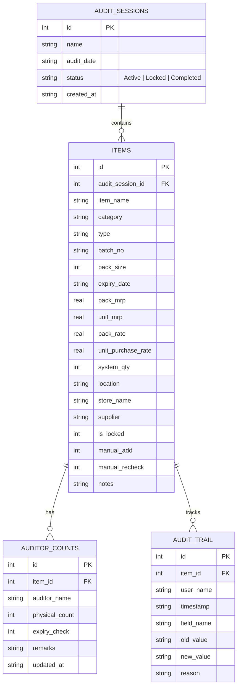

# Implementation Plan - Pharmacy Audit Application

We will build a centralized, collaborative web application that replaces manual pharmacy stock audits. It will support multiple auditors entering data in real-time, automate all audit calculations, provide a live dashboard breakdown, and export final reports matching the current format.

---

## User Review Required

> [!IMPORTANT]
> **Chosen Tech Stack:**
> - **Frontend:** React + Vite + Tailwind CSS + Lucide Icons (following the Zinc/shadcn design language with light/dark theme support).
> - **Backend:** Node.js + Express + SQLite (zero-config, self-contained, easy to backup and deploy).
> - **Real-Time Integration:** Periodic auto-save & REST polling (or Socket.io WebSockets) to synchronize counts between multiple users immediately.
> - **Data Analysis/Charts:** Apache ECharts for visual KPI cards and breakdown graphs.

> [!WARNING]
> **Excel Format Adaptability:**
> The two sample audit sheets (`Kukatpally mana Pharmacy Audit Report` and `Lifespan Final Report`) have different column headers (e.g., `AS per Software Quantity` vs `Qty`, `Expiry` vs `Exp Date`). We will build a flexible importer that automatically detects common column mappings and allows the user to manually verify them during import.

---

## Open Questions

> [!NOTE]
> Please review these questions and provide your feedback. I will adjust the implementation plan accordingly.

1. **Authentication Level:** Do you require a full secure login system (passwords, JWT) for users, or is a simple username dropdown/role selector sufficient since this is a local internal network tool?
2. **Audit Date Reference for Expiry:** Should "Expired Stock" be automatically classified based on the current date, or a custom "Audit Date" set at the start of the audit session (e.g., "Audit as on 22-03-2026")?
3. **Collaboration Strategy:** Is WebSockets (Socket.io) preferred for real-time synchronization, or is standard API polling (e.g., every 3-5 seconds) sufficient? Polling is easier to maintain and deploy, while WebSockets is near-instant.
4. **Excel Export Customization:** Should the app output the Excel report formatted exactly like the existing spreadsheets (with separate sheets for `Total Stock`, `Excess`, `Shortage`, `Extra Found`, `OT`, `Exp`)?

---

## Proposed Changes

### Database Layer
A local SQLite database will store all audit sessions, imported inventory items, real-time auditor entries, user settings, and change logs.

### Backend (Node.js + Express)
#### [NEW] [server.js](file:///e:/STOCK-MANAGEMENT/server/server.js)
Establish the Express server and REST API routes:
- `/api/audits` (GET, POST, DELETE): List/create/delete audit sessions.
- `/api/audits/:id/import` (POST): Import stock rows from uploaded Excel files.
- `/api/audits/:id/items` (GET, PUT): Paginate inventory lines; batch updates for counts.
- `/api/audits/:id/counts` (POST): Record individual auditor counts with expiry flags and remarks.
- `/api/audits/:id/dashboard` (GET): Get live totals and breakdown values.
- `/api/audits/:id/export` (GET): Download generated PDF or multi-sheet Excel reports.
- `/api/audits/:id/lock` (POST): Lock/unlock items or rows.
- `/api/audits/:id/trail` (GET): Retrieve logs for audits.

### Frontend (React + Vite)
We will scaffold the React app using Vite in `e:/STOCK-MANAGEMENT/frontend/`.

#### [NEW] [App.jsx](file:///e:/STOCK-MANAGEMENT/frontend/src/App.jsx)
Main navigation and layout containing:
- **Header:** Theme toggle (light/dark mode), audit session selector, current user role selector.
- **KPI Row:** Live counts of total stock value, net difference, gross shortage, excess, items audited.
- **Main View:**
  - Tab 1: Dashboard (ECharts visual breakdown by category, location, and supplier).
  - Tab 2: Audit Table (collaborative table, page size ~30 rows, expandable/collapsible details panel).
  - Tab 3: Extra Found (log new items not expected in the database).
  - Tab 4: Audit Trail (live list of edits/changes).

#### [NEW] [AuditTable.jsx](file:///e:/STOCK-MANAGEMENT/frontend/src/components/AuditTable.jsx)
Collaborative table showcasing:
- Predefined item columns, system quantities, and dynamic auditor columns.
- Sticky headers, row selection, and row highlighting.
- Highlighted anomalies (e.g. negative numbers, excessively high mismatch values).
- Search bar & filters for Result Category, Store Name, Location, Supplier.

#### [NEW] [DetailsPanel.jsx](file:///e:/STOCK-MANAGEMENT/frontend/src/components/DetailsPanel.jsx)
Sliding drawer panel that opens on row click to allow:
- Named auditor selection and count inputs.
- Expiry date verification checkbox and remarks log.
- Manual "Add" and "Recheck" adjustments.
- Row locking/unlocking (restricted to Audit Managers/Admins) with change reason prompts.

---

## Verification Plan

### Automated Tests
We will write Node.js integration tests in the `server` directory to test:
- Excel file parsing and matching.
- Auto-calculation logic (Total Qty, Difference Qty, Difference Value, Categories).
- Audit trail writing on edits.

### Manual Verification
- **Collaborative Sync Test:** Open two browser windows side-by-side, modify auditor counts in one, and verify they update in real-time in the other.
- **Import/Export Validation:** Import the provided reports (`Kukatpally` and `Lifespan`), run audit changes, export the resulting data back to Excel, and confirm the totals and layouts match exactly.
- **Dark Mode Check:** Verify the design system works seamlessly in both dark and light modes.
